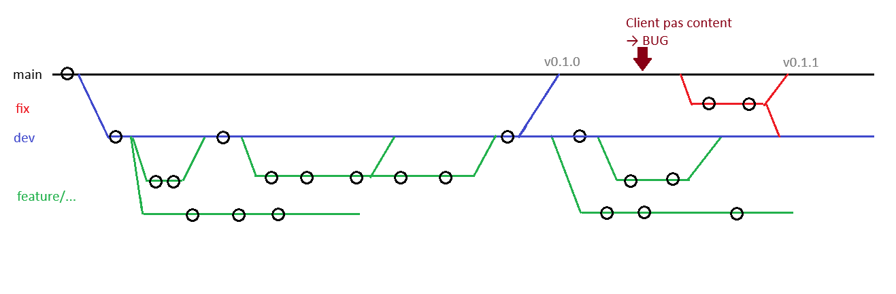

# 🤡 The Ultimate Anti-Pattern Web Project

[](https://developer.mozilla.org)
[](https://validator.w3.org/)
[]()
[](http://www.wtfpl.net/)

Bienvenue dans le dépôt officiel de tout ce que le monde professionnel essaie désespérément d'éviter. Ce projet a été conçu à des fins pédagogiques et cathartiques dans le cadre d'une formation web, servant de **musée des pires pratiques de développement**.

> ⚠️ **AVERTISSEMENT :** Ne reproduisez aucune de ces techniques dans un environnement de production sous peine de provoquer des saignements d'yeux chez vos seniors devs et des crises de panique chez les auditeurs W3C.

---



---

## 📋 Table des matières

- [Philosophie du Projet](#-philosophie-du-projet)
- [Prouesses Techniques](#-prouesses-techniques)
- [Stack & Anti-Patterns](#-stack--anti-patterns)
- [Architecture "Créative"](#-architecture-créative)
- [Historique des Commits](#-historique-des-commits)
- [Clause de Non-Responsabilité](#-clause-de-non-responsabilité)

---

## 💡 Philosophie du Projet

La plupart des formations vous apprennent à coder correctement. Ce projet explore la frontière obscure de l'ingénierie web : *Comment faire fonctionner un site tout en violant sciemment chaque règle d'accessibilité, de sémantique et de propreté du code ?*

C'est un hommage cynique à la dette technique, aux deadlines d'hier et au fameux *"Ça marche sur ma machine"*.

---

## 🔥 Prouesses Techniques (Les Pires Pratiques)

- 🧱 **La "Div Soup" Intégrale :** Remplacement systématique des balises sémantiques (`<header>`, `<article>`, `<main>`) par des `<div>` imbriquées sur 42 niveaux.
- 🎨 **Inline Styling Absolu :** Du CSS directement dans les attributs `style="..."` pour être sûr qu'aucune règle ne soit réutilisable ni maintenable.
- ♿ **Accessibilité Zéro (a11y) :** 
  - Attributs `alt=""` systématiquement oubliés ou remplacés par `alt="image"`.
  - Contrastes de couleurs garantis pour faire forcer la vue.
  - Formulaires sans balises `<label>` associés.
- 📐 **Non-Responsive par Choix :** Un design qui nécessite un scroll horizontal sur mobile ET sur écran 4K.
- 🏷️ **Balises Obsolètes :** Retour nostalgique des balises `<center>`, `<font>` et du légendaire `<marquee>`.

---

## 🛠️ Stack & Anti-Patterns

| Domaines | Technologie / Pratique Utilisée | Impact |
| :--- | :--- | :--- |
| **Sémantique** | Tag Soup & Tag Abandons | Confusion totale pour les moteurs de recherche |
| **Styles** | Redondance CSS & Overriding `!important` | CSS spaghetti de niveau olympique |
| **Asset Mgmt** | Images 4K non compressées (12 Mo/page) | Temps de chargement mesurable en minutes |
| **Versionning** | Messages de commit poétiques | Traçabilité rigoureusement impossible |

---

## 📁 Architecture "Créative"

L'arborescence a été pensée pour maximiser le temps de recherche d'un fichier :

```text
.
├── index.html
├── index2_FINAL.html
├── index_V3_vrai_truc.html
├── style.css
├── style2.css
├── test.css
├── images/
│   ├── IMG_20260924_114210.jpg
│   ├── image.png
│   ├── image(1).png
│   └── sans-titre.bmp
└── README.md
